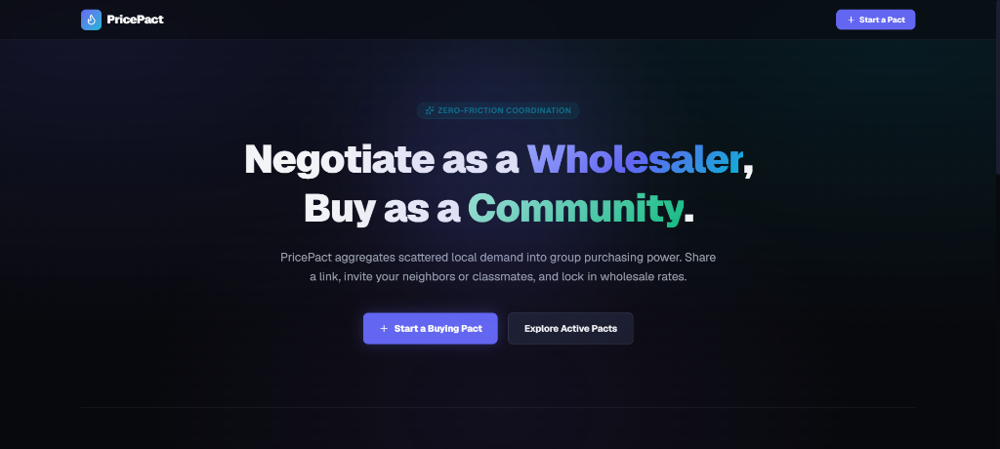
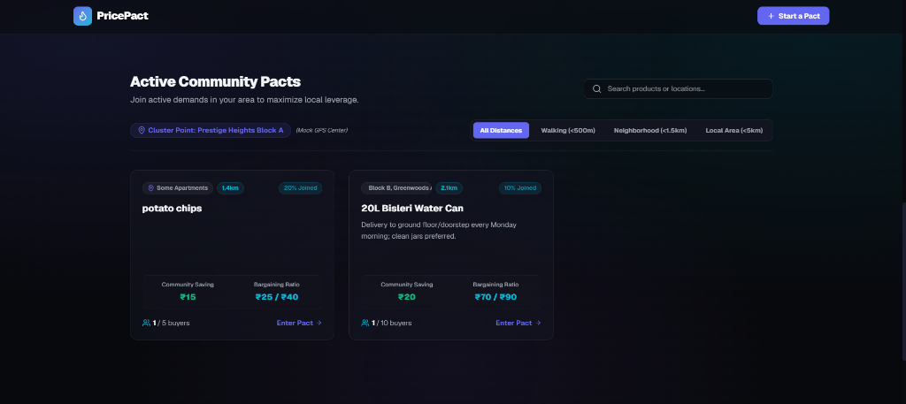
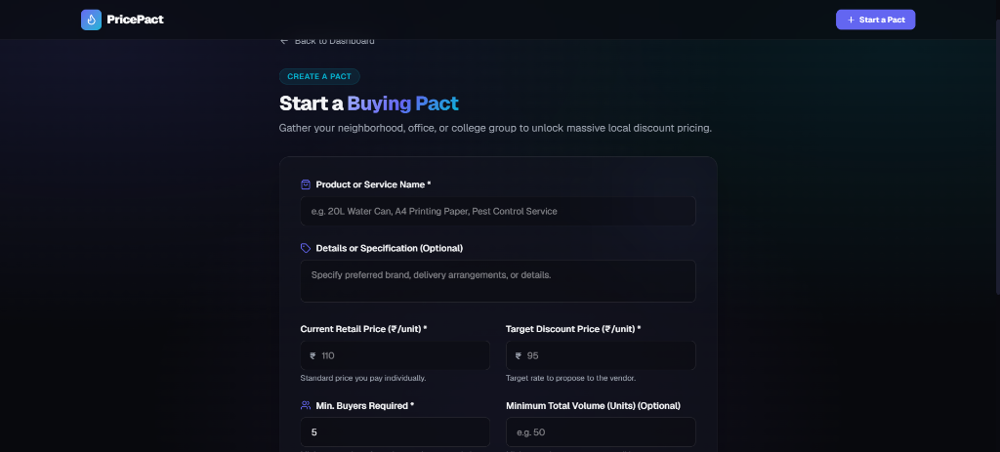
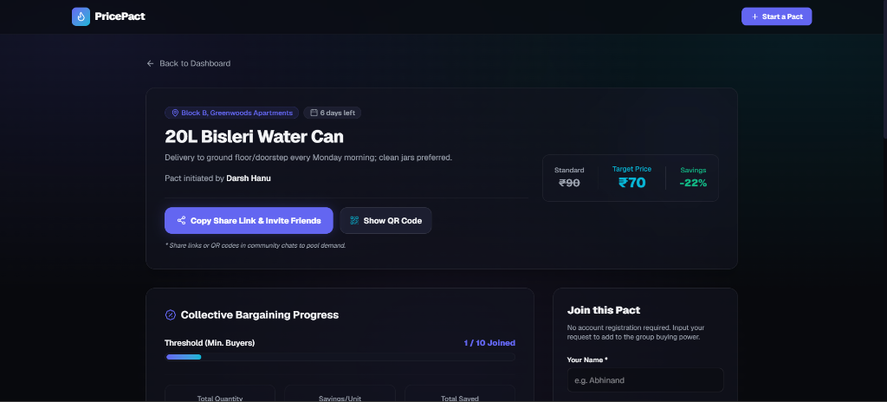
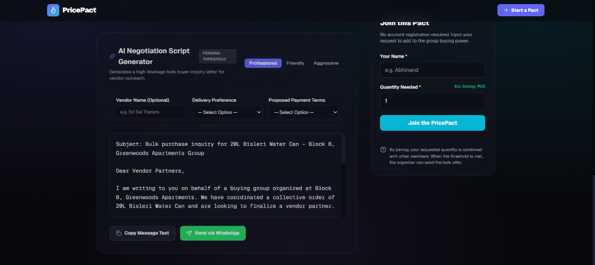

# PricePact

### ⚡ Turning scattered local demand into collective buying power.

**PricePact** is a lightweight, mobile-first community group-buying and negotiation platform designed for apartment complexes, student hostels, college campuses, and local office clusters. It enables individuals to aggregate their fragmented demand for everyday products and services (like water cans, stationery, pest control, or groceries) to secure bulk wholesale pricing from local merchants.

---

## 🚀 The Core Innovation

Unlike typical group-buying models, **PricePact holds no inventory, handles no payments, and manages no logistics.** It acts purely as a **coordination and negotiation layer** between buyers and existing local vendors. 

By consolidating scattered local demand into high-value bulk purchases, PricePact gives ordinary consumers the negotiating leverage of a commercial wholesaler.

---

## 🤝 How It Works (Zero-Friction Co-Buying)

PricePact is built to remove the biggest barrier to community group-buying: **the hassle of creating accounts.** 

There is **no registration, login, or password required** for co-buyers. Here is the exact lifecycle of a Pact:

1. **Create**: An organizer sets up a Pact in 60 seconds (specifying the item, standard retail price, target discount price, and minimum number of buyers needed).
2. **Share**: The organizer clicks the prominent **"Copy Share Link"** on the Pact details page and posts it in their apartment complex WhatsApp group, college hostel Discord, or office Slack.
3. **Join**: Neighbors and classmates click the link, open the dashboard, type their **Name** and **Quantity Needed**, and click **Join**. They instantly see their personal and community-wide savings updates.
4. **Negotiate**: When the threshold is reached, the organizer uses the **AI Negotiation Assistant** to generate a pitch draft, then clicks **"Send via WhatsApp"** to instantly message local vendors and secure the discount.

---

## 📸 Screenshots

### 🏠 Home Dashboard & Active Pacts



### 📂 Pact Creation Form


### 📊 Pact Details, Organizer Admin Panel & AI Negotiation



---

## ✨ Features

1. **Pact Creation & Presets**: 
   - Define a product, retail price, target price, minimum co-buyers, location boundary, and deadline.
   - **Quick-Start Preset Templates**: Pre-fill common local group-buying demands (Water Cans, Organic Eggs, Pest Control, Copier Paper, and Laundry Services) in one click.
2. **Pact Joining (Zero Auth)**: Anyone with the Pact link can instantly join by typing their name and required quantity.
3. **Collective Demand Tracker**: 
   - Displays real-time metrics (joined buyers count, total consolidated quantity, and target savings margin).
   - Dynamic **Bargaining Power Gauge** indicating the current leverage tier (Weak, Moderate, or Strong).
4. **Interactive Bargaining Simulator**:
   - Dynamic sandbox slider on details pages lets users simulate group growth (up to 50+ members).
   - Real-time computations project savings margins, simulated volume, and upgrade bargaining leverage to *Supercharged*.
5. **AI Negotiation Assistant (Customizable Outreach)**: 
   - Leverages Gemini to craft professional sales bids to vendors.
   - Offers three distinct bargaining personas: **Professional/Direct**, **Warm Community Appeal**, and **Aggressive Tender Bid**.
   - **Outreach Customizer**: Fine-tune pitch scripts by supplying custom Vendor Names, Delivery Preferences, and Payment Terms directly into the AI prompt and fallback generators.
   - Integrates **Direct WhatsApp Share** to launch pre-filled chats with local merchants immediately.
6. **QR Code Sharing**:
   - Toggles an interactive glassmorphic QR Code modal matching the Base64 state URL, allowing in-person scan-to-join operations.
7. **Local Geolocation Radius Filters**:
   - Filter active cluster pacts by physical radius relative to the user's mock GPS center (e.g. Walking distance < 500m, Neighborhood < 1.5km, Local Area < 5km).
   - Shows active distance badges (e.g., `150m away`, `1.2km away`) on card previews.
8. **Dual-Mode Data Sync (Bulletproof Offline Mode)**:
   - **Supabase PostgreSQL Mode**: Real-time multi-device cloud database sync.
   - **LocalStorage + URL-Encoding Fallback (No-DB Mode)**: If Supabase keys are absent, the application encodes the entire state (pact + participants) into a Base64 string in the URL. Sharing the URL shares the live state. **This makes the app 100% functional on Vercel without requiring any backend configuration!**

---

## 🛠️ Technology Stack

- **Frontend / Fullstack**: Next.js 16.3 (App Router)
- **Styling**: Tailwind CSS v4 (Featuring a dark theme, glassmorphic panels, and glowing mesh gradients)
- **Icons**: Lucide React
- **Cloud Database (Optional)**: Supabase JS Client
- **Generative AI**: Gemini 2.5 Flash REST client with offline compilation templates

---

## ⚡ Quick Start

### 1. Installation
Clone the repository and install dependencies:
```bash
npm install
```

### 2. Run Locally
Start the local development server:
```bash
npm run dev
```
Open [http://localhost:3000](http://localhost:3000) in your browser.

### 3. Build & Production Verification
Validate the production compilation pipeline:
```bash
npm run build
```

---

## 🛡️ Optional Environment Variables (`.env.local`)
To enable real-time database sync and live Gemini AI calls, create a `.env.local` file in the root:

```env
# Optional Supabase config (falls back to LocalStorage + URL Sync if empty)
NEXT_PUBLIC_SUPABASE_URL=your_supabase_project_url
NEXT_PUBLIC_SUPABASE_ANON_KEY=your_supabase_anon_key

# Optional Gemini key (falls back to rules-based template compiler if empty)
NEXT_PUBLIC_GEMINI_API_KEY=your_gemini_api_key
```

---

## 💡 Pitch Deck (Submission Copy)

- **One-line Pitch**: PricePact turns scattered local demand into collective buying power, helping communities negotiate better prices together.
- **Short Pitch**: "What if your apartment, hostel, or college could negotiate like a wholesaler? PricePact brings individual buyers together, aggregates their demand, and helps them negotiate better prices with local vendors without holding inventory or processing payments."
- **Why It Matters**: Individual buyers have weak bargaining power. Consolidated groups represent high guaranteed revenue. PricePact bridges this gap with a zero-friction, zero-setup community portal and AI negotiation templates.
